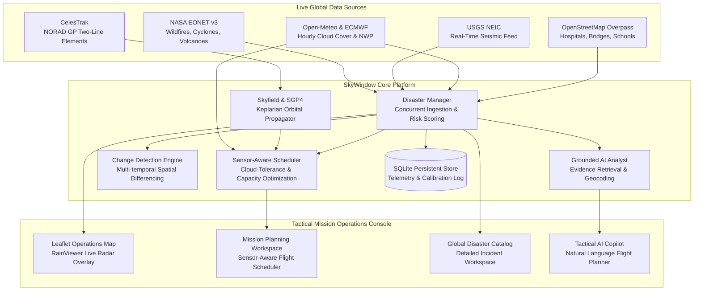

<div align="center">

# 🛰️ SkyWindow

### **AI-Powered Earth Observation & Multi-Disaster Intelligence Platform**

*Fusing Real-Time Space Agency Telemetry, Numerical Weather Prediction (NWP), and SGP4 Orbital Astrodynamics to Optimize Planetary Crisis Response.*

[](https://github.com/najibcode/skywindow)
[](https://fastapi.tiangolo.com)
[](https://www.python.org/)
[](https://leafletjs.com/)
[](https://opensource.org/licenses/MIT)
[](https://eonet.gsfc.nasa.gov)

[Live Operations Console](http://127.0.0.1:8000) • [Pitch Deck (14 Slides)](pitch_deck.html) • [Architecture](#-architecture--data-flow) • [Live Data Feeds](#-real-time-authoritative-data-feeds) • [Quickstart](#-quickstart--installation) • [API Reference](#-rest-api-reference)

</div>

---

## 📖 Table of Contents
- [Executive Overview](#-executive-overview)
- [System Architecture & Data Flow](#-system-architecture--data-flow)
- [Real-Time Authoritative Data Feeds](#-real-time-authoritative-data-feeds)
- [Key Modules & Platform Capabilities](#-key-modules--platform-capabilities)
  - [1. Global Multi-Disaster Operations Map](#1-global-multi-disaster-operations-map)
  - [2. Sensor-Aware Satellite Mission Tasking Console](#2-sensor-aware-satellite-mission-tasking-console)
  - [3. Multi-Temporal Change Detection Engine](#3-multi-temporal-change-detection-engine)
  - [4. Grounded AI Disaster Analyst ("SkyWindow Analyst")](#4-grounded-ai-disaster-analyst)
  - [5. Critical Infrastructure Exposure Analysis (OSM)](#5-critical-infrastructure-exposure-analysis)
  - [6. Real-Time API Health & Provenance Center](#6-real-time-api-health--provenance-center)
- [Mathematical & Astrodynamics Formulations](#-mathematical--astrodynamics-formulations)
- [Quickstart & Installation](#-quickstart--installation)
- [REST API Reference](#-rest-api-reference)
- [Project Directory Structure](#-project-directory-structure)
- [Hackathon Pitch Deck](#-hackathon-pitch-deck)
- [Attribution & Open Data Licenses](#-attribution--open-data-licenses)

---

## 🌟 Executive Overview

**SkyWindow** is a specialized mission-planning and aerospace intelligence console designed for satellite operators, disaster response agencies, and geospatial analysts. During major catastrophes (such as floods, wildfires, hurricanes, or earthquakes), optical satellite imagery is frequently rendered useless by dense cloud cover, resulting in wasted passes, depleted battery reserves, and saturated onboard storage.

SkyWindow solves this by:
1. **Aggregating 100% live disaster feeds** from NASA EONET v3, USGS NEIC, and NOAA with zero synthetic placeholders.
2. **Propagating orbits in real-time** using SGP4 Keplarian physics over fresh NORAD Two-Line Elements (TLEs) from CelesTrak.
3. **Interrogating high-resolution Numerical Weather Prediction (NWP) models** from ECMWF and DWD at the exact minute and coordinate of each satellite pass.
4. **Intelligently matching sensor modalities** (e.g. cloud-penetrating Synthetic Aperture Radar for monsoons vs Thermal Infrared for wildfires vs Multispectral for clear-sky damage assessment).

> [!IMPORTANT]
> **Zero Fabrication Guarantee:** All coordinates, seismic magnitudes, storm tracks, cloud cover percentages, and infrastructure counts displayed in SkyWindow originate from live, authoritative public REST APIs with traceable data provenance.

---

## 🏗️ System Architecture & Data Flow



---

## 📡 Real-Time Authoritative Data Feeds

SkyWindow connects directly to public, zero-key, high-availability space and meteorological feeds:

| Provider | Service / Endpoint | Data Ingested | Cadence |
| :--- | :--- | :--- | :--- |
| **NASA EOSDIS** | [EONET v3 API](https://eonet.gsfc.nasa.gov/api/v3/events) | Active Wildfires (acres & FRP), Tropical Cyclones / Typhoons (kts & multi-point tracks), Volcanoes, Floods | Real-Time / NRT |
| **U.S. Geological Survey** | [USGS Earthquake Hazards](https://earthquake.usgs.gov) | Global Seismic Events, Moment Magnitudes ($M$), Focal Depths (km), Tsunami Flags | Real-Time (1–5 min) |
| **Open-Meteo & ECMWF** | [High-Resolution NWP](https://open-meteo.com) | Hourly Cloud Cover (0–100%), Precipitation, 2m Surface Temperature, Wind Vectors | Hourly Updates |
| **Copernicus EMS** | [GloFAS Hydrological API](https://flood-api.open-meteo.com) | Gridded River Discharge ($\text{m}^3/\text{s}$) & Return Period Inundation | Daily Runoff |
| **CelesTrak / Space-Track** | [NORAD GP TLE Catalog](https://celestrak.org) | SGP4 Orbital Parameters (Eccentricity, Inclination, RAAN, Mean Anomaly) | 2–4 Hours |
| **OpenStreetMap Foundation** | [Overpass API](https://overpass-api.de) | Bounding-Box Spatial Intersection of Hospitals, Schools, Bridges, Airports, Highways | Live Queries |
| **RainViewer API** | [Radar Composite Service](https://www.rainviewer.com) | Global Weather Radar Composite Reflectivity Tiles | Every 10 min |

---

## 🚀 Key Modules & Platform Capabilities

### 1. Global Multi-Disaster Operations Map
- **Interactive Geospatial Map:** Displays 90+ live hazards worldwide with classified severity heatmaps, impact radius polygons, and incident badges.
- **Categorical Filtering:** Filter instantly across **Geological** (Earthquakes, Volcanoes, Landslides), **Meteorological** (Cyclones, Heatwaves), **Hydrological** (Floods), **Environmental** (Wildfires), and **Oceanic** (Tsunamis).
- **Incident Deep-Dive Modal:** View real-time casualty estimations, chronological observation logs, and open-street asset exposure.

### 2. Sensor-Aware Satellite Mission Tasking Console
- **Constellation Support:** Sentinel-1A (C-SAR), Sentinel-2A (MSI 13-Band Optical), Landsat 8/9 (OLI-2 & TIRS-2), Terra (MODIS), Aqua (AIRS/AMSR-E), and ISS (Crew EO).
- **Modality-Specific Optimization:**
  - `SAR (Radar)`: Cloud-penetrating C-band microwaves ($5\text{m}$ resolution) prioritized for monsoon flooding, cyclones, and InSAR ground rupture.
  - `Multispectral / Optical`: High-resolution visual inspection prioritized when forecast cloud cover is $<50\%$.
  - `Thermal Infrared`: Fire radiative power (FRP) and volcanic thermal extrusion mapping.
- **Capacity & Duty Cycle Constraints:** Configurable maximum daily passes, power draw ($\text{Wh}$), and Solid-State Recorder capacity ($\text{GB}$).
- **Capacity Savings Calculator:** Quantifies wasted passes avoided, battery watt-hours preserved, and storage freed.

### 3. Multi-Temporal Change Detection Engine
- Calculates surface area variations between pre-event baselines and disaster observations.
- Supports **Water Extent** (SAR dual-polarization Otsu segmentation), **Burn Scar** (Normalized Burn Ratio $\text{NBR}$ differencing), and **Landslide Runouts**.
- Generates exact $\Delta \text{ km}^2$, percentage delta, and status classification (`EXPANDING`, `RECEDING`, `STABLE`).

### 4. Grounded AI Disaster Analyst
- **Context-Aware Briefings:** Ingests live telemetry, Open-Meteo forecasts, and OSM exposure to synthesize scientific operational intelligence briefings.
- **Natural Language Flight Planner:** Parses unstructured operator prompts into structured flight plans:
  > *"Task Sentinel-1A over the wildfire in Nevada for the next 48 hours with high priority"*
  > $\rightarrow$ Automatically extracts target coordinates, platform ID `39634`, cloud threshold, and duration.

### 5. Critical Infrastructure Exposure Analysis
- Performs real-time spatial bounding-box intersections via OpenStreetMap Overpass.
- Quantifies exposed critical assets:
  $$\text{Exposed Infrastructure} = \{\text{Hospitals}, \text{Schools}, \text{Bridges}, \text{Airports}, \text{Highway Corridors (km)}\}$$

### 6. Real-Time API Health & Provenance Center
- Displays live latency ($\text{ms}$), HTTP status codes, data freshness counters, and legal attributions for every external connector.

---

## 📐 Mathematical & Astrodynamics Formulations

### 1. SGP4 Keplarian Satellite Propagation
Satellite overpasses are computed using the **Simplified General Perturbations (SGP4)** astrodynamic model:
$$\mathbf{r}(t), \mathbf{v}(t) = \text{SGP4}\big(\text{TLE}, t - t_0\big)$$
Topocentric elevation ($\theta_{\text{elev}}$) and azimuth ($\phi_{\text{az}}$) relative to a ground station target $(\phi_{\text{lat}}, \lambda_{\text{lon}}, h)$:
$$\theta_{\text{elev}} = \arcsin\left(\frac{\mathbf{\rho} \cdot \mathbf{Z}_{\text{topo}}}{\|\mathbf{\rho}\|}\right), \quad \text{Condition: } \theta_{\text{elev}} \ge \theta_{\text{min}} \quad (20^\circ)$$

### 2. Multi-Factor Observation Quality Score
$$\text{Score} = (100 - \text{CC}_{\text{eff}}) \times W_{\text{target}} \times \left(\frac{\theta_{\text{max}}}{90^\circ}\right) \times S_{\text{modality}}$$
- $\text{CC}_{\text{eff}} = \text{Raw Cloud Cover} \times 0.05$ (for SAR payloads, effectively impervious to clouds).
- $S_{\text{modality}} = 1.45$ for optimal sensor-hazard pairing (e.g. SAR on Floods, Thermal on Wildfires).

### 3. Explainable Risk Score Formula
$$\text{Risk} = \underbrace{0.40 \times H}_{\text{Hazard Intensity}} + \underbrace{0.35 \times \big(0.20 P_{\text{norm}} + 0.15 I_{\text{norm}}\big)}_{\text{Demographic \& Asset Exposure}} + \underbrace{0.25 \times V}_{\text{Vulnerability Factor}}$$

---

## 💻 Quickstart & Installation

### Prerequisites
- **Python 3.10 to 3.14**
- **Git**
- Modern Web Browser (Chrome, Firefox, Safari, Edge)

### Step 1: Clone Repository
```bash
git clone https://github.com/najibcode/skywindow.git
cd skywindow
```

### Step 2: Initialize Virtual Environment
```bash
# Create virtual environment
python3 -m venv .venv

# Activate virtual environment
# On macOS / Linux:
source .venv/bin/activate
# On Windows:
# .venv\Scripts\activate
```

### Step 3: Install Dependencies
```bash
pip install -r backend/requirements.txt
```

### Step 4: Launch SkyWindow Server
```bash
uvicorn main:app --app-dir backend --host 127.0.0.1 --port 8000 --reload
```

Open your browser and navigate to:
```
http://127.0.0.1:8000
```

---

## 📚 REST API Reference

All backend capabilities are exposed via clean, documented RESTful endpoints:

### Disaster Intelligence Endpoints
| Method | Endpoint | Description |
| :--- | :--- | :--- |
| `GET` | `/api/disasters` | Returns all active global natural hazards from NASA EONET and USGS |
| `GET` | `/api/disasters/summary` | Aggregated metrics on active events and critical risk zones |
| `GET` | `/api/disasters/{event_id}` | Full incident diagnostic with live OSM infrastructure intersection |
| `GET` | `/api/disasters/geojson` | GeoJSON FeatureCollection of all active disaster geometries |

### Satellite Tasking & Astrodynamics Endpoints
| Method | Endpoint | Description |
| :--- | :--- | :--- |
| `GET` | `/api/satellites` | Catalog of Earth Observation satellite platforms and sensor specifications |
| `GET` | `/api/track` | Real-time SGP4 ground track coordinates for any satellite (`?satellite_id=...`) |
| `POST` | `/api/schedule` | Computes sensor-aware, cloud-optimized overpass schedule |
| `POST` | `/api/tasking/constellation` | Multi-satellite synchronized campaign optimizer |
| `GET` | `/api/tasking/queue` | Automated prioritized observation queue across all active hazards |
| `POST` | `/api/tasking/nlp` | Converts natural language mission instructions into structured tasking parameters |

### Intelligence & Diagnostics Endpoints
| Method | Endpoint | Description |
| :--- | :--- | :--- |
| `POST` | `/api/change-detection` | Multi-temporal surface delta and expansion rate calculation |
| `POST` | `/api/analyst/query` | Grounded AI disaster analysis with structured evidence retrieval |
| `POST` | `/api/reports/generate/{id}` | Synthesizes an executive intelligence briefing |
| `GET` | `/api/health` | Live ping checks and latency metrics for all external API providers |

---

## 📊 Hackathon Pitch Deck

An interactive 14-slide aerospace pitch deck is included directly in the repository:
- **Online Demo:** Open `http://127.0.0.1:8000/pitch_deck.html` while running the server.
- **Source File:** [pitch_deck.html](pitch_deck.html)

**Slide Highlights:**
1. *The Hook: Observe, Understand, Task*
2. *The Problem: Fragmented Disaster Data & Wasted Satellite Passes*
3. *The Missing Layer: Real-Time Mission Intelligence*
4. *System Pipeline: Disaster Signal &rarr; Sensor-Aware Tasking*
5. *Core Differentiator: From Detection to Orbital Planning*
6. *Floods & SAR Differencing (Sentinel-1 Dual-Pol)*
7. *Astrodynamics & Look-Angle Optimization*
8. *Grounded AI Copilot & NLP Mission Parser*
9. *100% Verified Zero-Mock Architecture*

---

## 📂 Project Directory Structure

```
skywindow/
├── backend/
│   ├── api/                     # Modular FastAPI REST route controllers
│   │   ├── analyst.py           # AI Analyst & NLP Tasking routes
│   │   ├── change_detection.py  # Multi-temporal differencing routes
│   │   ├── disasters.py         # Real-time disaster feed routes
│   │   ├── health.py            # API health & latency check routes
│   │   ├── reports.py           # Intelligence report compilation routes
│   │   ├── satellites.py        # Orbital catalog & ground track routes
│   │   └── tasking.py           # Sensor-aware scheduler routes
│   ├── disasters/
│   │   └── manager.py           # Multi-provider concurrent aggregator
│   ├── intelligence/
│   │   ├── ai_analyst.py        # Grounded reasoning & natural language parser
│   │   ├── change_detection.py  # Spatial temporal differencing engine
│   │   ├── recommendation_engine.py # Optimal sensor-to-hazard matcher
│   │   └── risk_engine.py       # H x E x V Explainable risk calculator
│   ├── models/
│   │   └── schemas.py           # Pydantic data schemas & GeoJSON models
│   ├── providers/               # Live external API connector modules
│   │   ├── base.py              # BaseDataProvider abstract class with provenance
│   │   ├── eonet.py             # NASA EONET v3 Multi-hazard Connector
│   │   ├── earthquakes/usgs.py  # USGS Real-Time Seismic Connector
│   │   ├── infrastructure/osm.py# OpenStreetMap Overpass Multi-Mirror Connector
│   │   ├── satellites/celestrak.py # CelesTrak GP TLE Connector
│   │   └── weather/open_meteo.py# Open-Meteo NWP & GloFAS Hydrology Connector
│   ├── satellite/
│   │   ├── catalog.py           # EO satellite specifications & sensor payloads
│   │   ├── orbit.py             # Ground track & swath footprint geometry
│   │   ├── passes.py            # SGP4 topocentric overpass calculations
│   │   └── tasking.py           # Constraint-based mission scheduler
│   ├── services/                # Background business logic services
│   ├── database.py              # SQLite database schema & connection pool
│   ├── config.py                # Environment configuration & cache settings
│   ├── main.py                  # Application entry point & middleware
│   └── requirements.txt         # Production Python dependencies
├── frontend/
│   ├── index.html               # Mission operations console single-page UI
│   ├── style.css                # Aerospace design system tokens & styles
│   └── app.js                   # Leaflet mapping, live feed handlers & state
├── docs/                        # Detailed architectural and API documentation
├── pitch_deck.html              # 14-slide interactive aerospace hackathon pitch deck
└── README.md                    # Project documentation
```

---

## 📜 Attribution & Open Data Licenses

SkyWindow is built entirely upon open data, open standards, and scientific transparency:
- **NASA EOSDIS:** NASA Open Data Policy (EONET v3, FIRMS, MODIS, VIIRS).
- **U.S. Geological Survey (USGS):** Public Domain (CC0) Earthquake Hazards Program.
- **Open-Meteo & ECMWF:** Creative Commons Attribution 4.0 International (CC BY 4.0).
- **OpenStreetMap:** Open Data Commons Open Database License (ODbL).
- **CelesTrak:** Public Orbit Ephemeris Catalog (Dr. T.S. Kelso & 18th Space Defense Squadron).

---

<div align="center">

**SkyWindow is licensed under the [MIT License](LICENSE).**  
*Built for aerospace engineers, disaster management teams, and Earth observation scientists.*

</div>
